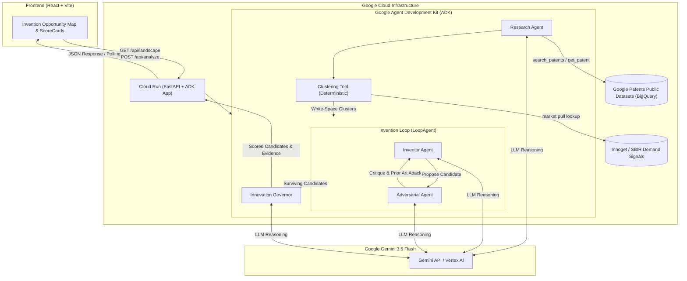

# System Architecture — ip-matchmaker

**Patent Innovation Agent** — mines patent landscapes (Google Patents Public Datasets on BigQuery), detects technology white-spaces, proposes candidate inventions, stress-tests them with adversarial prior art attacks, and scores surviving proposals with traceable evidence.

---

## Architecture Diagram



### Text / ASCII Topology

```text
                    Gemini 3.5 Flash
                           │
                           ▼
User → Frontend → Cloud Run / FastAPI (Entrypoint)
                           │
                     Google ADK Graph
                           │
        ┌──────────────────┼──────────────────┐
        ▼                  ▼                  ▼
    Research           Invention           Governor
      Agent               Loop               Agent
        │              ┌────────┐              │
        │              │Inventor│              │
        │              └───┬────┘              │
        │                  ▼                   │
        │            ┌───────────┐             │
        │            │Adversarial│             │
        │            └───────────┘             │
        ▼                                      ▼
    BigQuery                               ScoreCard
  Patents Data                                 │
        │                                      │
        └──────────────────┬───────────────────┘
                           ▼
                        Frontend
```

---

## Core Components & Agent Boundaries

1. **Frontend (React + Vite SPA)**
   - Renders the Invention Opportunity Map and cluster white-spaces.
   - Triggers pipeline execution via `POST /api/analyze` and polls `GET /api/analyze/{job_id}`.

2. **Cloud Run / FastAPI Backend (`backend/main.py`)**
   - Serves as the single Cloud Run container entrypoint (`PORT=8080`).
   - Wraps the ADK runner, provides `/health`, `/api/landscape` (deterministic, LLM-free), and background `/api/analyze` execution.

3. **Google ADK Agent Graph (`backend/patent_agent/agent.py`)**
   - **`research_agent`**: Queries patent landscape (BigQuery or Mock fallback).
   - **`clustering` FunctionTool**: Deterministic CPC grouping & Innoget/SBIR demand-signal market-pull evaluation (`white_space_score = 0.4·(1-density) + 0.2·recency + 0.15·citation_velocity + 0.25·demand`).
   - **`invention_loop` (`LoopAgent`)**: Iterative proposal & attack loop between `inventor_agent` and `adversarial_agent`.
   - **`governor_agent`**: Evaluates novelty, prior-art risk, differentiation, and evidence scores backed by explicit prior-art citations.

4. **BigQuery Patents Data (`BigQueryPatentsDataSource`)**
   - Primary data source: Google Patents Public Datasets (`patents-public-data.patents.publications`).
   - Configurable via `USE_MOCK_BIGQUERY` (`true` for local dev/testing; `false` for real GCP BigQuery queries).

---

## State Management Rationale

- **In-Memory Job Store (`_jobs` in `main.py`)**:
  - Analysis jobs run as background `asyncio` tasks.
  - Cloud Run deployments pin `--max-instances=1`, ensuring state consistency and preventing multi-instance drift during the demo.
  - **Rationale**: Optimal for hackathon execution and $0 demo quota requirements.
  - **Scale Path**: If multi-instance horizontal scaling is required, swap `_jobs` dictionary with Google Cloud Firestore.

---

## Shared State Contract

| State Key | Producer Agent | Consumer Agent(s) / Outputs |
|---|---|---|
| `patent_landscape` | `research_agent` | `clustering` tool, `inventor_agent` |
| `selected_cluster_context` | seeded by `main.py` (see `tools/context.py`) | `inventor_agent`, `adversarial_agent`, `governor_agent` |
| `candidate_inventions` | `inventor_agent` | `adversarial_agent`, `governor_agent`, frontend |
| `adversarial_verdicts` | `adversarial_agent` | `inventor_agent` (iteration loop), `governor_agent`, frontend |
| `scored_candidates` | `governor_agent` | Frontend ScoreCard display |

*(Source of truth: `backend/patent_agent/shared/state_keys.py`)*
